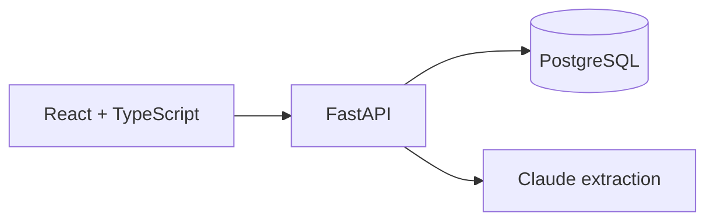

# FreightIQ

FreightIQ turns freight invoice PDFs into structured records that can be reviewed for
billing errors. The current application has a React interface, FastAPI API, Claude-based
field extraction, model-assisted audit code, and PostgreSQL persistence.

## Current status

Implemented now:

- PostgreSQL persistence through SQLAlchemy 2 and versioned Alembic migrations
- Decimal database columns for monetary values, foreign keys, constraints and indexes
- FastAPI upload, invoice, audit, dashboard and database-health endpoints
- Strict PDF content type, signature and size checks
- React/TypeScript upload, detail and dashboard views
- Local Docker images and PostgreSQL Compose service

Still in progress:

- Uploads and Claude extraction currently happen in the request path
- Uploaded PDFs are not yet stored in S3-compatible object storage
- Audit validation and automated tests need strengthening
- Redis/Celery workers and job polling are not implemented yet

No hosted deployment, processing-volume claim or model-accuracy result is claimed.

## Architecture



The database is the system of record. SQLite has been removed from the runtime. Alembic,
rather than application startup, owns schema changes. Background processing and object
storage will be added only with their actual worker and retrieval paths.

## Local setup

Docker is the reproducible path:

```sh
git clone https://github.com/kanishk-sc/freightiq.git
cd freightiq
copy .env.example .env
docker compose up -d --build --wait
cd frontend
npm ci
npm run dev
```

On macOS/Linux, use `cp` instead of `copy`. Add an Anthropic API key to `.env` before
uploading an invoice. The API is at `http://localhost:8000`, its OpenAPI UI is at
`http://localhost:8000/docs`, and Vite serves the frontend at `http://localhost:5173`.

For backend development without the API container:

```sh
cd backend
python -m venv .venv
python -m pip install -r requirements.txt
alembic upgrade head
uvicorn main:app --reload --port 8000
```

Use `backend/.env.example` in this mode; its database URL targets the published local
PostgreSQL port `5433`.

## Database migrations

```sh
docker compose run --rm api alembic upgrade head
docker compose run --rm api alembic current
```

The initial migration creates invoices, line items and audit flags with cascading foreign
keys. Money is stored as `NUMERIC`, not binary floating point.

## Verification

```sh
python -m ruff format --check backend
python -m ruff check backend
docker compose config --quiet
docker compose build api
docker compose run --rm api alembic upgrade head
```

Automated backend tests and a stronger CI gate arrive with the processing and audit
phases. The existing frontend can be checked with `npm run typecheck` and `npm run build`.

## Security boundary

Development services bind to localhost and use documented local-only credentials. CORS
origins are explicit and environment-driven. Uploads must declare PDF content, begin
with a PDF signature, and remain under the configured byte limit. This demo has no user
authentication and must not be exposed directly to the public Internet.
