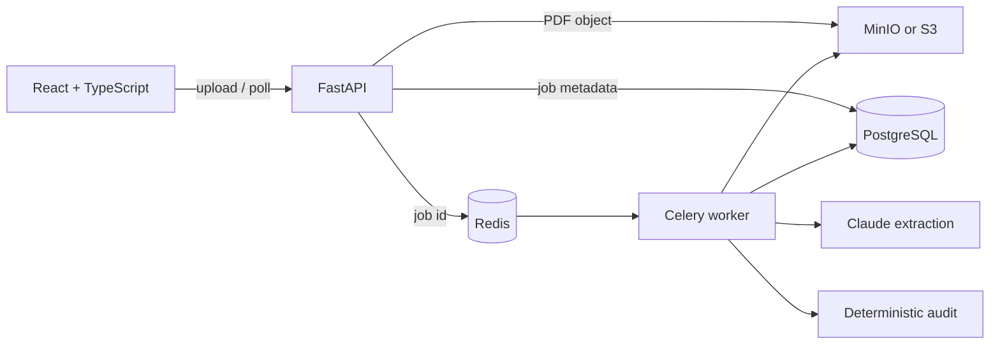

# FreightIQ

FreightIQ turns freight-invoice PDFs into validated, reviewable records without holding
an HTTP request open while the document is processed.

## Demo

There is no hosted demo. The complete stack runs locally with Docker Compose.

## Problem

Freight invoices mix semi-structured text with calculations that must be exact. FreightIQ
uses Claude only to extract a typed candidate record; ordinary Python code then checks
required fields, dates, line-item arithmetic, duplicate charges, subtotals and totals.

## Architecture



The upload endpoint validates the PDF, stores it under an opaque object key, creates a
durable job and returns `202 Accepted`. A Celery worker performs extraction and auditing.
Retries lock the job row and reuse its document, so they cannot create duplicate invoices.

## Key engineering features

- Four explicit job states (`queued`, `processing`, `completed`, `failed`) with safe error codes
- S3-compatible document storage with content metadata and SHA-256 integrity metadata
- Strict Pydantic validation around Claude JSON; bounded input and request timeout
- Deterministic decimal arithmetic and duplicate-charge detection outside the model
- SQLAlchemy 2 models and versioned Alembic migrations on PostgreSQL
- Typed React polling flow with upload, processing, failure and completed states
- Prometheus metrics for bounded-route API traffic and durable worker outcomes
- Tests for the API, worker idempotency, parser, validation, malformed model output,
  audit arithmetic and a real MinIO object round trip

## Tech stack

React 19, TypeScript, Vite, FastAPI, Pydantic, SQLAlchemy, Alembic, PostgreSQL,
Redis, Celery, Anthropic Claude, MinIO/S3, Prometheus metrics, Docker Compose, pytest
and GitHub Actions.

## Repository structure

```text
backend/        FastAPI, worker, domain logic, migrations and pytest suite
frontend/       React/TypeScript application
docs/           implementation checklist and engineering notes
docker-compose.yml
```

## Local setup

1. Copy `.env.example` to `.env` and set `ANTHROPIC_API_KEY`.
2. Start the backend stack:

```sh
docker compose up -d --build --wait
```

3. Start the frontend in a second terminal:

```sh
cd frontend
npm ci
npm run dev
```

The API is at `http://localhost:8000`, OpenAPI at `http://localhost:8000/docs`, the UI
at `http://localhost:5173`, and the MinIO console at `http://localhost:9101`.

For backend development outside Docker, create a Python 3.11 environment, install
`backend/requirements-dev.txt`, copy `backend/.env.example` to `backend/.env`, and run
`alembic upgrade head` before starting Uvicorn.

## Environment variables

`.env.example` documents PostgreSQL, CORS, Anthropic and S3 credentials. The checked-in
values are local-development defaults only. Do not commit a populated `.env` file.

## Testing

The backend suite uses real PostgreSQL and MinIO but mocks external model calls, so it
does not consume Claude credits:

```sh
docker compose up -d postgres redis minio --wait
docker compose run --rm api alembic upgrade head
docker compose run --rm api alembic check
docker compose --profile test build tests
docker compose --profile test run --rm tests python -m ruff format --check .
docker compose --profile test run --rm tests python -m ruff check .
docker compose --profile test run --rm tests
cd frontend
npm ci
npm run typecheck
npm run build
```

## Architecture decisions

- **PostgreSQL** is the durable source of truth and provides constraints and row locking.
- **Redis and Celery** keep variable-duration model work out of the request lifecycle.
- **S3-compatible storage** keeps binary documents out of relational rows and supports
  local MinIO plus an AWS S3 endpoint without changing application code.
- **Pydantic plus deterministic auditing** treats model output as untrusted input and
  reserves exact calculations for code.
- **Polling** is intentionally simpler than WebSockets for this one-job-at-a-time workflow.

## Current status

Implemented: asynchronous PDF ingestion, durable jobs, object storage, Claude extraction,
deterministic audits, PostgreSQL migrations, React polling, Prometheus-format API/worker
outcome metrics, Docker development and CI tests.

This repository does not claim production users, accuracy figures or a live deployment.

## Future work

Authentication and tenant isolation are the first prerequisites for any hosted version,
followed by encrypted production storage, retention/deletion controls and deployment.

## Security boundary

Uploads require a PDF MIME type and signature and are size-limited. Original filenames
are sanitized and never become object keys. CORS origins are explicit. Logs and persisted
errors exclude document contents and secrets. The local services use development
credentials and bind published ports to loopback; the app has no authentication and must
not be exposed directly to the public Internet.
